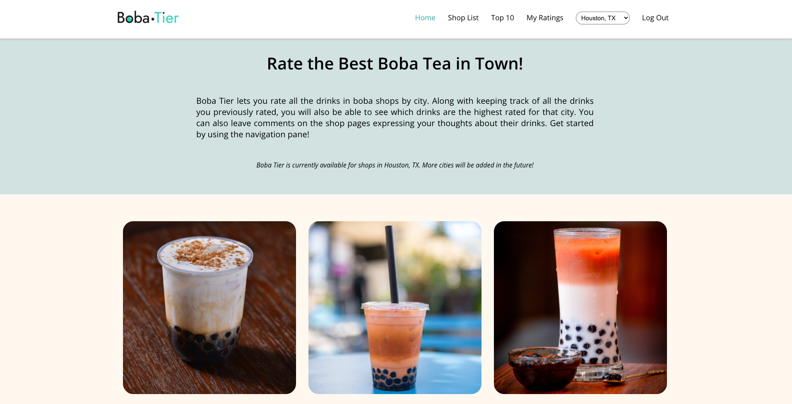
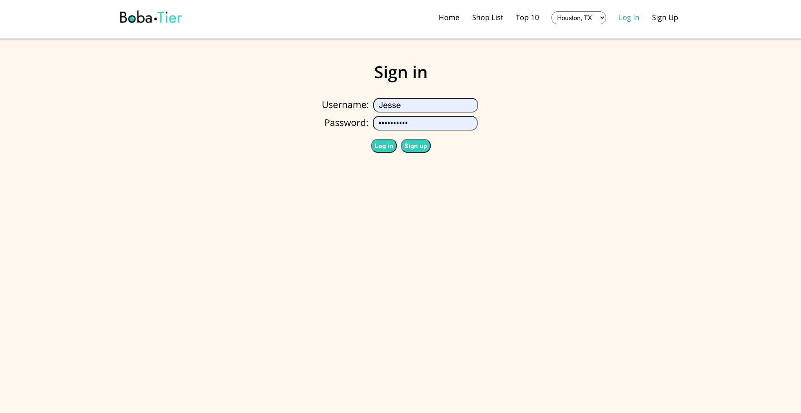
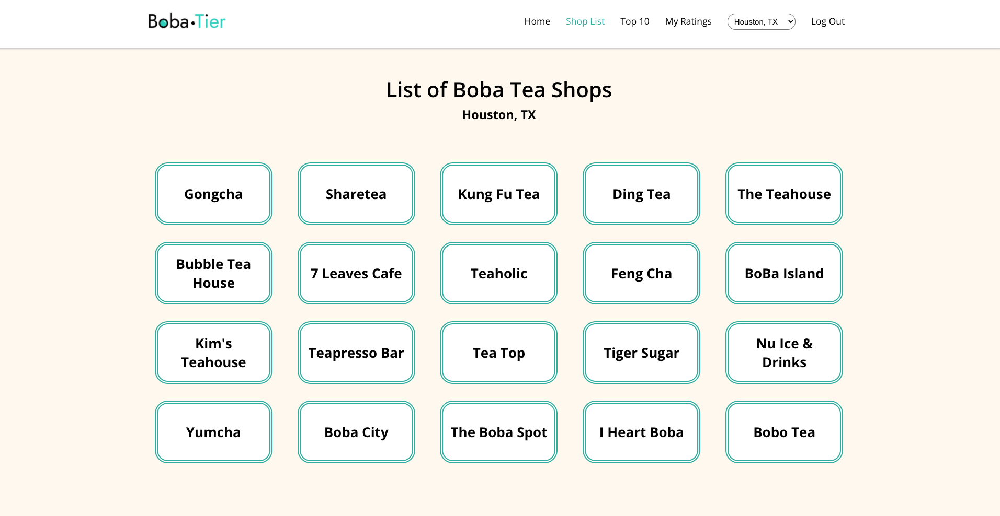
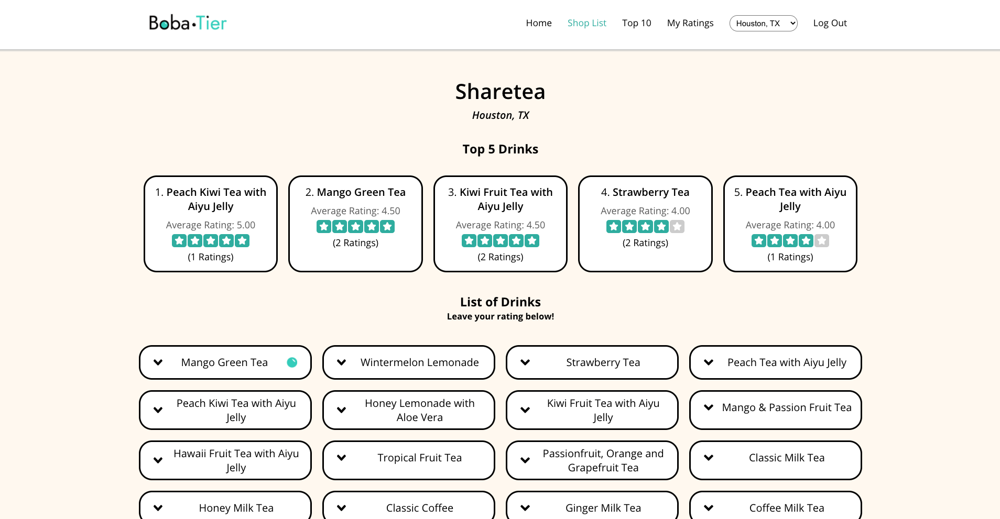
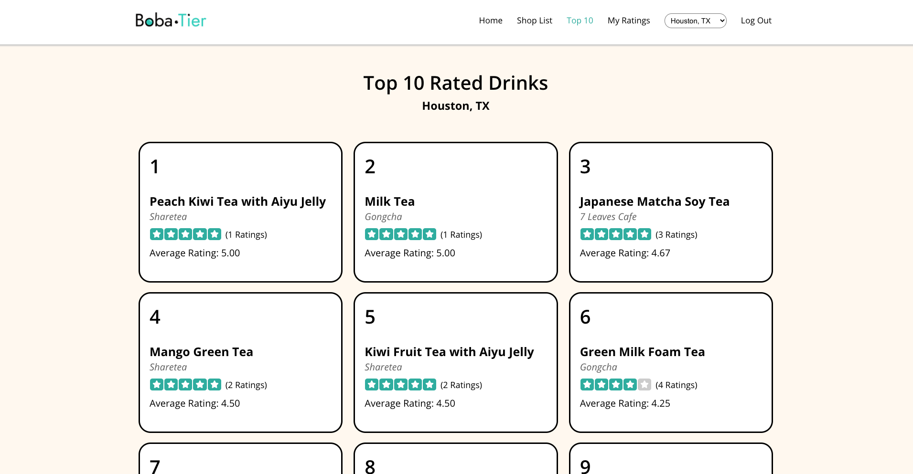
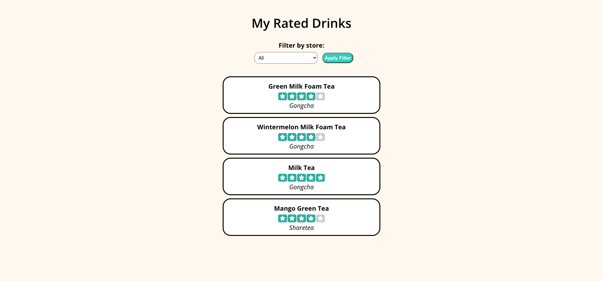

# Boba Tier
 * * *
 

## Live
 --------------

Demo: [https://boba-tier-app.vercel.app/](https://boba-tier-app.vercel.app/)  
Client Repo: [https://github.com/jessetran03/boba-tier-app](https://github.com/jessetran03/boba-tier-app)  
Server Repo: [https://github.com/jessetran03/boba-tier-api](https://github.com/jessetran03/boba-tier-api)

## Summary
 --------------

 Boba Tier is a web application that enables you to rate the drinks for boba shops by city. The application allows the user to track the boba drinks that they have rated and see which drinks are the top-rated drinks in the city. The user can also leave comments on the individual shop pages to express their thoughts about that shop.

## API Documentation
 --------------
 POST /api/auth/login  
 POST /api/users  
 GET /api/shops  
 GET /api/shops/:shop_id  
 GET /api/shops/:shop_id/comments  
 GET /api/drinks  
 POST /api/drinks  
 GET /api/drinks/:drink_id  
 DELETE /api/drinks/:drink_id  
 GET /api/ratings  
 POST /api/ratings  
 PATCH /api/ratings/:rating_id  
 POST /api/comments

## Screenshots
  --------------
 Landing Page:
 

 Login Page:
 

 Workout List Page:
 

 Workout Exercises Page:
 

 Exercise list Page:
 

 Exercise Log Page:
 

## Technologies Used
 --------------

 1. JavaScript
 2. Node
 3. Express
 4. JWT
 5. Chai, Mocha

## Seeding

psql -U jessetran -d bobatier -f ./seeds/seed.bobatier_tables.sql
